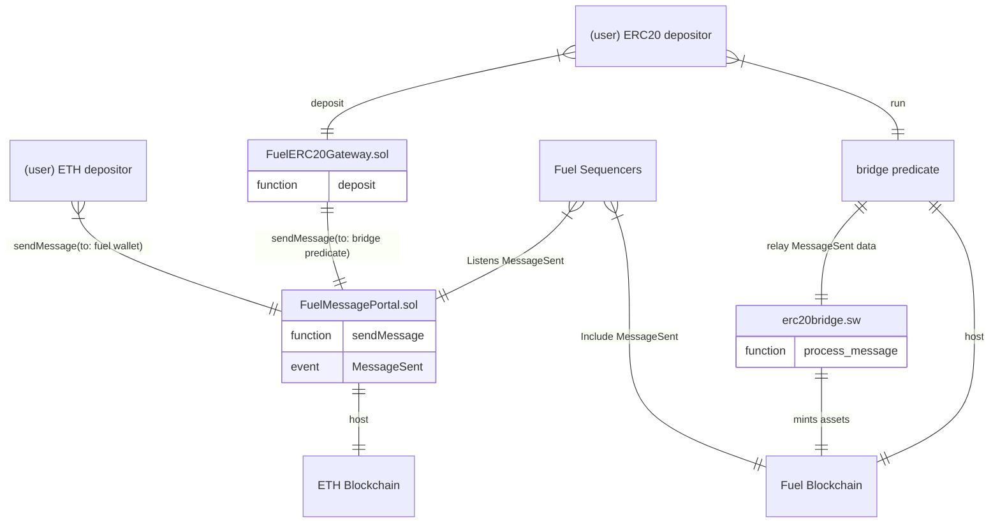
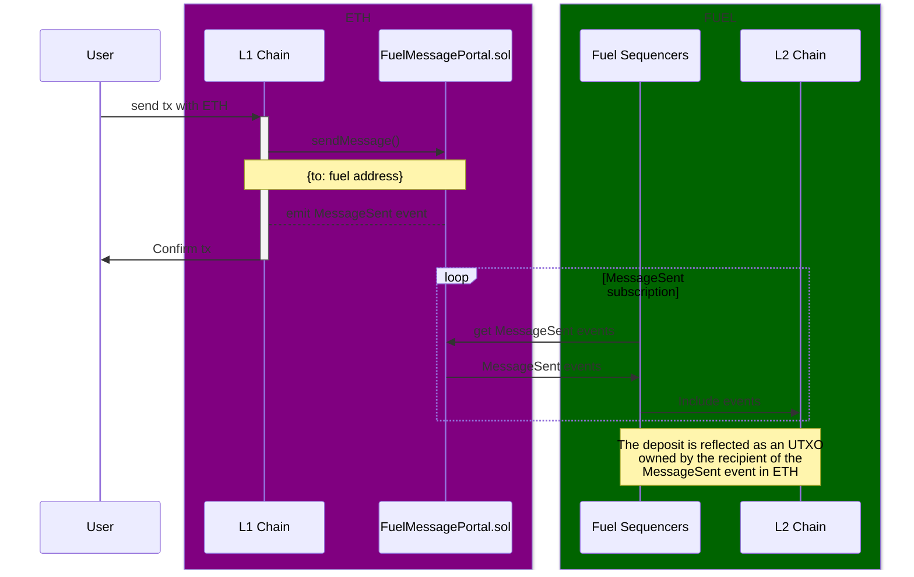
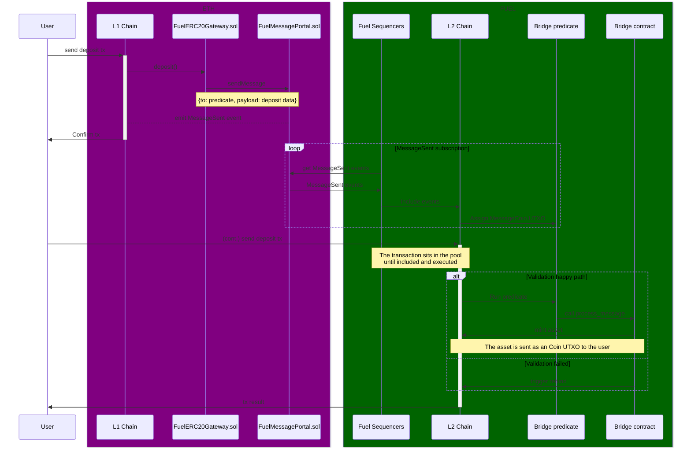
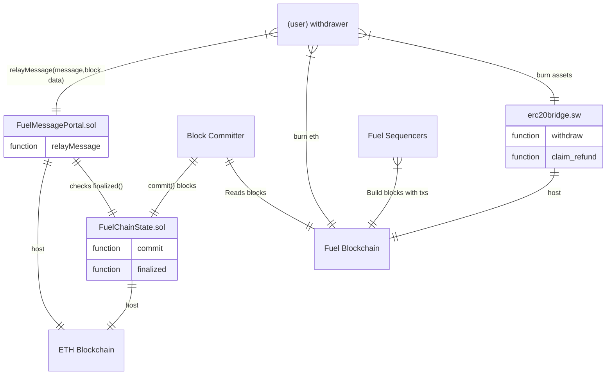
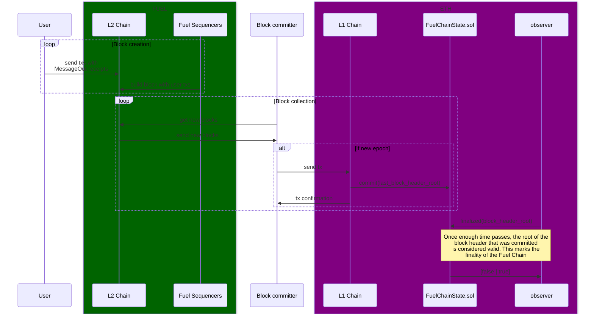
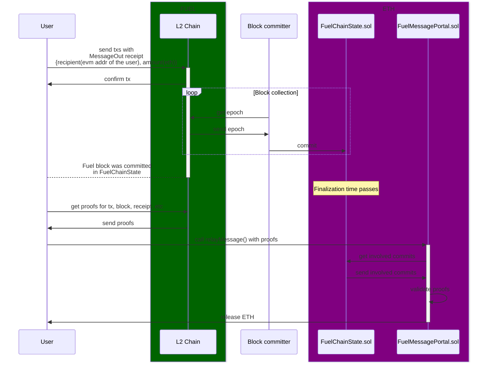

# Architecture

This document aims to provide a high-level overview of Fuel's token bridge and its current operation.

## Concepts

Before delving into the details, let's understand a few key concepts that will be referenced throughout this document:

- Layer 1 (L1): An EVM blockchain, namely Ethereum.
- Layer 2 (L2): The Fuel blockchain will sometimes be referred as the Layer 2 or L2.
- Fuel block: a block of the Fuel blockchain, generated by sequencers. It contains transactions, but also messages, outgoing and relayed.
- Fuel root block: the last block of a Fuel epoch.
- Fuel epoch: A group of Fuel blocks, packed together and identified by the last block of the epoch.
- Outgoing messages: Messages that are generated in the L1 blockchain that must be sent to L2 entities.
- Relayed messages: Messages that are generated in the L2 (Fuel) blockchain that must be sent to L1 entities.
- Fuel sequencers: Entities that process L2 transactions and keep the ledger updated.
- L1 Commits: Transactions on the L1 that start the finalization process of a Fuel epoch.
- Finality: State of commits by which the commit cannot be changed, it is considered honest and immutable - final. When an epoch is committed, a clock starts. If the commit is correct, time will pass and the epoch will be final - it cannot be reverted or changed. If the commit is not correct, an honest party can challenge it.
- Block comitter: entity responsible for listening to finished epochs from the Fuel Blockchain and comitting these epochs to the `FuelChainState` contract.
- `FuelChainState` contract: L1 Smart contract that holds epoch information.
- `FuelMessagePortal` contract: L1 Smart contract that is able to validate relay messages from Fuel Blocks that have been committed to the state contract, and relays those messages to the corresponding entities in L1
- Layer 1 Bridge smart contract: L1 smart contract that holds L1 tokens. Upon user deposits, it generates an message for the L2 counterpart to mint the associated L2 token.
- Layer 2 Bridge smart contract: L2 (Fuel) smart contract that mints L2 tokens when receiving messsages from the L1 counterpart. Similarly, burns L2 tokens and generates a withdrawal message for the L1 contract to release L1 tokens to their rightful owner.
- Deposit: User action by which some L1 tokens are locked in the L1 bridge smart contracts, minting the same amount in the L2 chain.
- Withdrawal: User action by which some L2 tokens are burnt in the L2 bridge smart contracts, releasing the burnt amount in the L1 chain.

## Bridge flow

Fuel 's bridge system is built on a message protocol that allows to send (and receive) messages between entities located in two different blockchains, namely the L1 (Ethereum or EVM) and L2 (Fuel blockchain). The system features sending messages in both directions (L1 to L2, and L2 to L1), though the mechanisms involved for each direction are different and almost independent.

It can be derived that if the entities receiving these messages are capable of interpreting them, some actions can be executed.

From here on, you will read first the logic involved in the L1 to L2 message passing, and viceversa after.

### Message passing from L1 to L2 (a.k.a. outgoing messages)

The [Message Portal](../packages/solidity-contracts/contracts/fuelchain/FuelMessagePortal.sol) contains a `sendMessage` function that can be called by any entity on the L1 blockchain. This function will emit an event `MessageSent` to be picked up by Fuel 's sequencers, optionally containing an ETH value that will be depositted in the contract, and a data payload. The sequencers will include said message in the following blocks of the L2 blockchain, by adding an UTXO that reflects the original message.

The `MessageSent` event emitted on the Ethereum chain and its counterpart UTXO `MessageCoin` on the Fuel chain hold, among other fields, a `value` (amount of ETH that is deposited), a payload `data` and an ID `recipient` that can spend this message in the L2.
 
The following figure contains a view of all the components involved in outgoing messages:

#### L1 (Ethereum) ETH Deposit

Since `MessageSent` events and their spawned `MessageCoin` UTXOs can carry a value, an ETH deposit consists merely of the action of calling `sendMessage` on the L1 with some attached ETH. The recipient in the L2 will see its balance updated by means of the inclusion of the `MessageCoin` that reflects this value in the L2.

#### L1 (Ethereum) ERC20 Deposit

A deposit operation is an use case of the message passing system from L1 entities to L2 entities. The user will send a transaction to deposit an asset in a L1 bridge contract `FuelERC20Gateway`, which will in turn call `sendMessage` and emit a `MessageSent` event through the `FuelMessagePortal` to be picked up by the Fuel blockchain 's sequencer. The recipient of this message shall be the `bridge predicate` (a L2 entity that posseses an ID), whose role will be explained further ahead. The payload of the message will just reflect the fact that the `FuelERC20Gateway` has received a deposit of a L1 token, with a given amount and a desired recipient. Sequencers will include this message as part of an UTXO that can be spent by the `bridge predicate`. The `predicate` holds these UTXOs until any other entity (which can be the users themselves, or another "relayer" entity) executes the predicate 's logic, which has the responsibility for running validation logic before sending the data to the bridge contract on the L2, `erc20bridge.sw`, by calling `process_message`. Once the UTXO is "spent" (delivered), this last contract will have the capability of processing the payload inside the message, validating that their sender is the L1 bridge contract `FuelERC20Gateway`, and then proceeding to mint an equivalent asset and amount in the Fuel blockchain to the one originally depositted in the L1. Then, the minted assets become available to the user in the L2.

You can follow the actual implementation of the message processing flow via:

- [L1 FuelERC20Gateway](../packages/solidity-contracts/contracts/messaging/gateway/FuelERC20Gateway) 's `deposit` function (check last version of the contract)
- [FuelMessagePortal](../packages/solidity-contracts/contracts/fuelchain/FuelMessagePortal) 's `sendMessage` function (check last version)
- [L2 Bridge contract](../packages/fungible-token/bridge-fungible-token/src/main.sw) 's `process_message` function
- [L2 predicate](../packages/message-predicates/contract-message-predicate/predicate_asm.rs) predicate that holds the UTXOs meant to be relayed to the bridge contract. Runs some pre-validation logic before relaying the messages to the bridge contract.

### Message passing from L2 to L1 (a.k.a. incoming messages)

The mechanism that implements messaging from L2 to L1 can be more convoluted; bear with us.

Any user (or contract) on the L2 can trigger transactions that generate [receipts](https://github.com/FuelLabs/fuel-specs/blob/master/src/abi/receipts.md). Among these receipts, it is possible to include the `MessageOut` receipt, carrying among other things, a `sender` ID from the Fuel chain, a `recipient` address of the L1 chain, an `amount` of the base currency used in the L1, and a `data` payload. Each Fuel block header contains a merkle root built from the `MessageOut` receipts, making it trivial to build a merkle proof for the inclusion of specific `MessageOut` payloads in a Fuel block.

Fuel blocks are packed and committed together by the mechanism described in the section `Block committing` in epochs. A Fuel epoch will be committed at the [Chain State contract](../packages/solidity-contracts/contracts/fuelchain/FuelChainState.sol) with the last block of the epoch, namely the `Fuel root block`. This block features another `Merkle root` that commits to a tree consisting of the block hashes of the epoch. Again, the hash of this root block is derived, among other elements, from this root.

Once the committed epoch has finalized, an user in the L1 blockchain can prove that the original message was included in the finalized epoch:

- First, it is needed to prove that a certain block (identified by its block hash) exists in the committed epoch. This is done with a `Merkle proof`.
- Once proven that the block exists, by the same mechanism, it is possible to prove that the message exists as part of the block.

An user can request proofs of inclusion of both the block inside the epoch, and the message inside the block, to the L2, then attach those proofs on a call to [Message Portal](../packages/solidity-contracts/contracts/fuelchain/FuelMessagePortal.sol) 's `relayMessage`. The portal will check that the proofs are correct and that the finalization status of the epoch, then proceed to unpack the payload of the message, that should contain execution instructions.

Find below a figure describing the general relationships between all the systems involved in this process.

#### Block committing

The Fuel blockchain aims to be scalable, and thus is able to generate blocks at a faster rate than other blockchains, without compromising on its security. It does so by inheriting the security of the L1 it is anchored to. The mechanism allowing this is an hybrid optimistic-ZK rollup approach. Blocks generated in the Fuel blockchain are grouped in epochs (e.g. an epoch can group together 10800 blocks), and epochs are identified and summarized in the last block of said epoch. This block can be committed to the L1 blockchain with a transaction to the `FuelChainState` contract, and will be accepted optimistically (i.e. the commit is considered valid unless proven otherwise - validation of the blocks, as well as decentralization of the entities that are able to commit blocks, are not considered in the scope of this document). The commit will be registered with the timestamp of the L1 blockchain. Then, once a certain time period has passed, the commit (along with the block) will be considered final. This finalization enables entities in the L1 chain to execute and relay messages originating from the L2 to their L1 recipients.

#### L2 (Fuel) ETH Withdrawal

An ETH withdrawal can be accomplished just by sending a transaction from a Fuel entity that generates a `MessageOut` receipt, with the desired Ethereum address as recipient, and the withdrawn value coded in the `amount`. After the transaction is picked up by the L2 network and included in one of its blocks, eventually, a `block committer` shall update the [Chain State contract](../packages/solidity-contracts/contracts/fuelchain/FuelChainState.sol) by committing the last epoch of the Fuel blockchain. Once enough time has passed, the epoch will be considered valid and the user will be able to call [Message Portal](../packages/solidity-contracts/contracts/fuelchain/FuelMessagePortal.sol) 's `relayMessage` with the appropiate Merkle proofs that witness the activity of the L2 chain. This way, the user can prove the existence of a `MessageOut` receipt in with these proofs, and the ETH that was originally locked in the portal contract can be finally released to the `recipient` of the unpacked `MessageOut` specified in the call.

A simplified sequencer diagram shows the process below:

#### L2 (Fuel) Withdrawal

A bridge withdrawal is an example implementation of message passing from L2 entities to L1 entities.

The user will start the process by signaling a withdrawal transaction to the [L2 Bridge Contract](../packages/fungible-token/bridge-fungible-token/src/main.sw), which will burn the tokens and generate a message to be included in a Fuel block, with recipient to the [L1 Bridge Contract](../packages/solidity-contracts/contracts/messaging/gateway/FuelERC20Gateway.sol). This message will be relayed later on by means of the block committer and the [Message Portal](../packages/solidity-contracts/contracts/fuelchain/FuelMessagePortal.sol).

Once the transaction has been included in the Fuel blockchain, the user will need to await two events:

- First, the Fuel blockchain will need to close the epoch. The epoch will be committed to the L1 blockchain in the [Chain State contract](../packages/solidity-contracts/contracts/fuelchain/FuelChainState.sol). It will be possible to prove the inclusion of all the blocks in the epoch with the `Merkle root` of the `Fuel root block` (commit).
- Then, once the epoch has been committed, it is needed to wait for its finalization.

After finality has been reached for the epoch that includes the block where the withdrawal transaction was signaled, the user can request the proofs of inclusion of both the message in the Fuel block, and the Fuel block in the Fuel epoch. The user will send a transaction call to the [Message Portal](../packages/solidity-contracts/contracts/fuelchain/FuelMessagePortal.sol) 's `relayMessage` function that will check the attached proofs and the finalization status of the epoch that the message belongs to, then proceed to unpack the payload of said message, that should contain an execution instruction to call `finalizeWithdrawal` in the [L1 Bridge Contract](../packages/solidity-contracts/contracts/messaging/gateway/FuelERC20Gateway.sol), releasing the L1 locked tokens.

You can follow the implementation of this flow via:

- [bridge_fungible_token.sw](../packages/fungible-token/bridge-fungible-token/src/bridge_fungible_token.sw) 's `withdraw` function
- [FuelChainState.sol](../packages/solidity-contracts/contracts/fuelchain/FuelChainState.sol) 's `commit` and `finalized` functions
- [Message Portal](../packages/solidity-contracts/contracts/fuelchain/FuelMessagePortal.sol) 's `relayMessage` function
- [FuelERC20Gateway.sol](../packages/solidity-contracts/contracts/messaging/gateway/FuelERC20Gateway.sol) 's `finalizeWithdrawal`

## Decimals adjustment

Easing the operation and participation of light clients in the network without compromising on security is a key principle in Fuel. In that sense, Fuel strives to minimize the size of the information that is exchanged between peers through the protocol. One of the design decisions furthering that goal is the use of 64 bits (`u64`) to code the balances that are bridged from L1 to L2. The most popular token standard, `ERC20`, codes the amounts with `256 bits`. If the amount transferred from L1 to L2 surpasses the capacity of Fuel to mint the L2 counterpart, a `refund` message will be generated, that will allow the user to retrieve the originally depositted amount in L1.

Additionally, it is a de-facto practice in the space to use 18 decimals to represent the token, whereas in Fuel, 9 decimals are used to represent amounts under the unit. This means that there is a potential loss of precision when it comes to translating L1 amounts to L2 amounts, as the user could lose some dust amounts between bridging operations. Ideally, this limitation could be worked around as long as the deposits initiated in L1 do not specify amounts greater than 9 decimals (i.e. 1.0000000010 does not lose amounts, 1.0000000011 would lose 0.0000000001). DApps that enable bridge operations should observe this limitation and truncate the amounts to avoid loss of precision.
